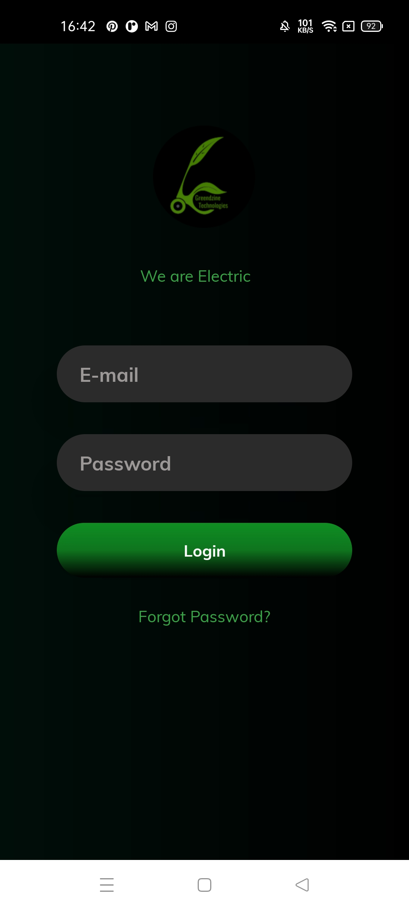
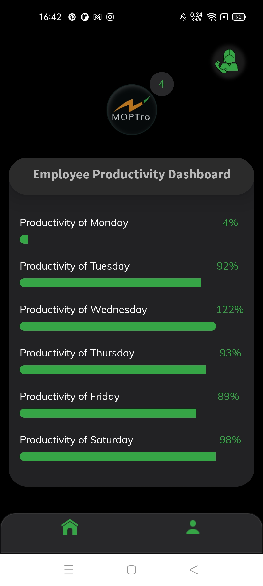
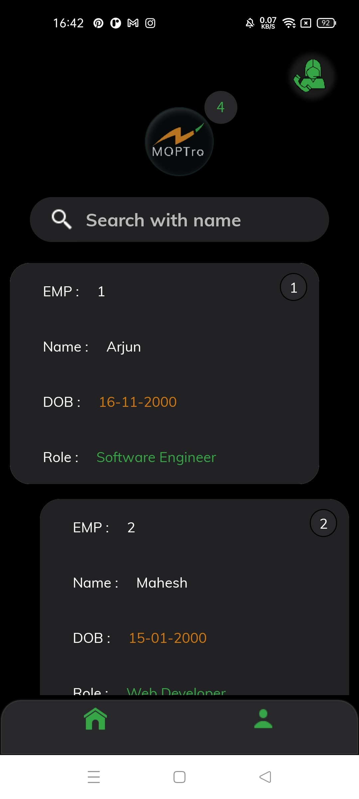

# Employee Productivity Tracker

**Employee Productivity Tracker** is an Android application for monitoring employee productivity on a daily basis. This app is compatible with most Android devices in portrait mode.

## Features

- **Login Page**: Users can log in using any pattern for their email and password fields. However, for a successful login, both fields must be entered.
- **Dashboard**: Displays employee productivity from Monday to Saturday. Each day's productivity is represented as a percentage with a corresponding progressbar.
- **Navigation**: Users can navigate between the Dashboard and Employee Profile pages using the home and user icons.
- **Employee Profiles**: Shows a list of employee details including employee ID, name, date of birth, and role. Users can search for specific employees by name.
  
## Screenshots

## Technologies Used

- Android Studio
- Kotlin

## Contributors

- [Bhavani Rathod](https://github.com/Bhavani-Rathod)
